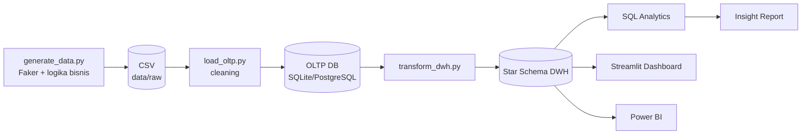

# 📊 End-to-End Retail BI Platform untuk UMKM Indonesia

> Platform Business Intelligence *end-to-end* untuk chain fashion UMKM fiktif
> **"Rumah Mode Nusantara"** — dari desain database, data warehouse, ETL pipeline,
> hingga dashboard interaktif dan *actionable business insight*.

<p align="left">
  
  
  
  
  
</p>

---

## 🎯 Project Overview

Proyek portofolio yang mendemonstrasikan **alur BI lengkap** yang biasa dikerjakan seorang
*BI / Data Analyst*: memahami proses bisnis retail, merancang OLTP database, membangun
**data warehouse (star schema)**, menulis **ETL pipeline**, menjawab pertanyaan bisnis
dengan **SQL analitik**, dan menyajikannya dalam **dashboard** yang dipakai owner untuk
mengambil keputusan.

Domain: **fashion & apparel** — lengkap dengan atribut khas (ukuran, warna, brand) dan
pola musiman Indonesia (**Ramadan/Lebaran**, **Harbolnas 11.11 & 12.12**).

## 🧩 Business Problem

UMKM fashion punya banyak data transaksi, tetapi jarang mengubahnya jadi keputusan.
Platform ini menjawab 8 pertanyaan inti:

1. Produk paling laris & paling menguntungkan?
2. Produk *revenue* tinggi tapi *margin* rendah?
3. Cabang terbaik & terburuk?
4. Pelanggan paling loyal & *repeat rate*?
5. Produk *slow moving / dead stock*?
6. Produk yang perlu *restock*?
7. Tren penjualan musiman?
8. Channel penjualan paling efektif?

Detail: [docs/01_business_case.md](docs/01_business_case.md).

## 🏗️ Architecture



Diagram lengkap: [docs/architecture.md](docs/architecture.md).

## 🗄️ Database Schema

- **OLTP (transaksional):** 11 tabel ternormalisasi — [ERD](docs/erd_oltp.md)
- **Data Warehouse (star schema):** `fact_sales`, `fact_inventory` + 5 dimensi
  konform — [Star Schema](docs/star_schema.md)
- **Kamus data lengkap:** [docs/02_data_dictionary.md](docs/02_data_dictionary.md)

## 🛠️ Tech Stack

| Layer | Teknologi |
|-------|-----------|
| Bahasa | Python 3.10+, SQL |
| Database | PostgreSQL (utama) · SQLite (fallback, zero-setup) |
| Data & ETL | pandas, NumPy, Faker, SQLAlchemy |
| Dashboard | Streamlit + Plotly (utama), Power BI (panduan) |
| Dokumentasi | Markdown + Mermaid |

## 📈 Dashboard (6 Halaman)

| Halaman | Isi |
|---------|-----|
| **Executive Overview** | KPI (revenue, profit, margin, AOV, repeat rate), tren bulanan, kontribusi kategori |
| **Sales Performance** | Tren harian, channel, metode pembayaran, pola mingguan |
| **Product & Category** | Best seller, margin tertinggi, Pareto kategori, analisis ukuran & warna |
| **Inventory & Restock** | Nilai stok, low-stock alert, dead stock, rekomendasi restock |
| **Customer Analysis** | Repeat rate, member tier, segmentasi RFM, demografi, top customer |
| **Branch Performance** | Ranking cabang, channel mix, tren per cabang |

> 📸 Letakkan screenshot dashboard di [`assets/screenshots/`](assets/screenshots/).
> _(Placeholder — jalankan dashboard lalu tangkap layar tiap halaman.)_

## 💡 Key Insights (contoh dari data)

- Puncak penjualan di **Ramadan (Maret Rp 1,31 M)** & **Harbolnas (Des Rp 1,12 M)**.
- Satu produk hero (**Rok Senja Label**) menyumbang ±9% revenue → risiko konsentrasi.
- **Rp 411 juta** modal mengendap di **22 SKU dead stock**.
- Cabang **Medan** tertinggal ~**6×** dari flagship Jakarta.
- Channel **online sudah 51%** revenue dengan AOV setara/lebih tinggi dari offline.

10 insight + rekomendasi aksi: [docs/03_insight_report.md](docs/03_insight_report.md).

## 🚀 How to Run

```bash
# 1. Clone & masuk folder
git clone <repo-url> && cd UMKM-BI-Platform

# 2. (Opsional) buat virtual environment
python -m venv .venv && source .venv/bin/activate    # Windows: .venv\Scripts\activate

# 3. Install dependencies
pip install -r requirements.txt

# 4. Jalankan ETL pipeline (default SQLite — tanpa setup DB apa pun)
python etl/run_pipeline.py

# 5. Jalankan dashboard
streamlit run dashboard/streamlit_app.py
```

**Pakai PostgreSQL?** Salin `.env.example` → `.env`, set `DB_ENGINE=postgres` dan isi
kredensial, lalu ulangi langkah 4–5. Skema DDL tersedia di `sql/oltp/` & `sql/warehouse/`.

### Struktur Folder
```
UMKM-BI-Platform/
├── docs/            # business case, data dictionary, insight, ERD, diagram
├── sql/             # DDL OLTP, DDL warehouse, query analitik
├── etl/             # generate → load → transform (run_pipeline.py)
├── data/            # CSV mentah + database SQLite (generated)
├── dashboard/       # Streamlit app (6 halaman) + panduan Power BI
└── assets/          # screenshots
```

## 🔮 Future Improvements

- **SCD Type 2** pada `dim_product` / `dim_customer` untuk melacak perubahan harga & tier.
- **Orkestrasi** dengan Apache Airflow / Dagster + penjadwalan incremental load.
- **Data quality tests** (Great Expectations / dbt tests) dan migrasi transformasi ke **dbt**.
- **Forecasting** permintaan (Prophet/ARIMA) untuk rekomendasi restock prediktif.
- **Deploy** dashboard ke Streamlit Community Cloud + CI/CD.

---

## 👤 Author

**Marco Alexander** — Information Systems (Business Intelligence).
Portofolio ini menunjukkan kemampuan *end-to-end BI*: business analysis, data modeling,
data warehousing, ETL, SQL analytics, dan data visualization.
