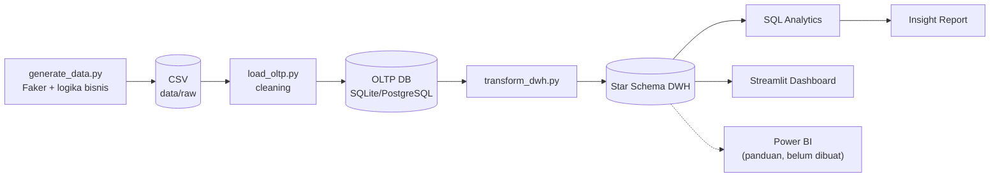
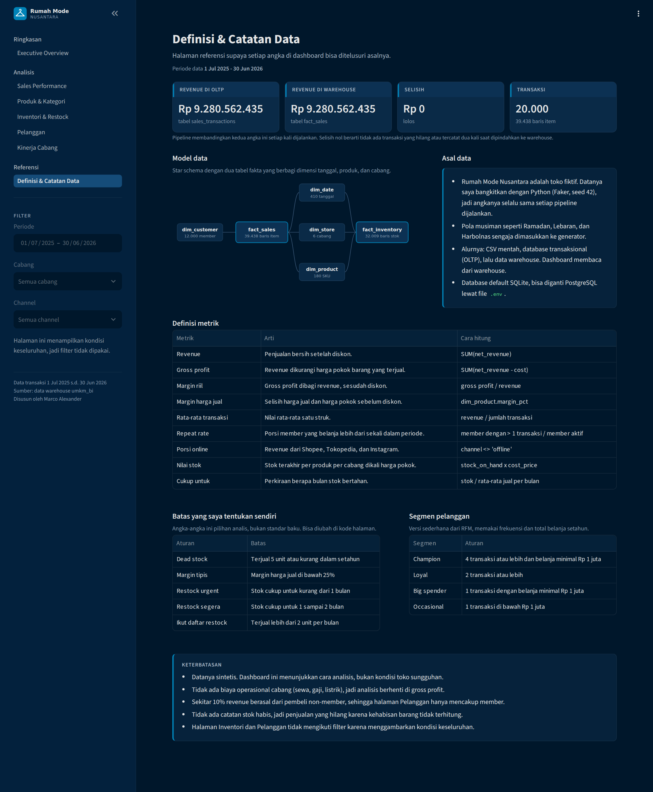

# End-to-End Retail BI Platform untuk UMKM Indonesia

Proyek ini saya buat untuk mempraktikkan alur kerja BI dari awal sampai akhir
pada sebuah chain fashion UMKM fiktif bernama **Rumah Mode Nusantara**. Saya
merancang database transaksional, membangun data warehouse dengan star schema,
menulis ETL pipeline di Python, menjawab pertanyaan bisnis dengan SQL, lalu
menyajikannya dalam dashboard Streamlit tujuh halaman.

Datanya saya bangkitkan sendiri dengan Faker, lengkap dengan atribut khas fashion
(ukuran, warna, brand) dan pola musim belanja Indonesia seperti Ramadan, Lebaran,
dan Harbolnas.


## Pertanyaan yang ingin dijawab

Pemilik UMKM fashion biasanya punya banyak data transaksi, tapi jarang
memakainya untuk mengambil keputusan. Saya membatasi analisis pada delapan
pertanyaan:

1. Produk apa yang paling laris dan paling menguntungkan?
2. Produk mana yang revenue-nya tinggi tapi margin-nya rendah?
3. Cabang mana yang terbaik dan terburuk?
4. Seberapa loyal pelanggan, dan berapa repeat rate-nya?
5. Produk mana yang tidak laku dan menahan modal?
6. Produk mana yang perlu segera di-restock?
7. Bagaimana pola penjualan sepanjang tahun?
8. Channel penjualan mana yang paling efektif?

Latar belakang lengkapnya ada di [docs/01_business_case.md](docs/01_business_case.md).

## Apa yang saya temukan

Total revenue dalam 12 bulan adalah Rp 9,28 miliar dengan margin 38,4%. Secara
umum bisnisnya sehat, tapi ada beberapa hal yang menahan profit dan kas:

- **Rp 411 juta modal tertahan di 22 SKU yang hampir tidak laku**, atau 32% dari
  seluruh nilai stok.
- **25 SKU bermargin tipis menyerap 12,4% revenue tapi cuma menyumbang 3,1%
  gross profit.** Satu topi yang laris bahkan hanya bermargin 6,1% setelah diskon.
- **39% revenue setahun terjadi di tiga bulan saja**: Maret dan April saat
  Ramadan, serta Desember saat Harbolnas.
- **Satu produk, Rok Senja Label Abu-abu, menyumbang 9% revenue.**
- **Cabang Medan hanya menghasilkan sekitar seperenam dari Jakarta**, dan separuh
  dari cabang reguler terlemah lainnya.
- **Channel online sudah 51% revenue**, dengan nilai transaksi rata-rata yang
  sedikit lebih tinggi dari offline.
- **Tier member belum membedakan pelanggan.** Rata-rata belanja per orang hampir
  sama di Bronze, Silver, dan Gold.

## Dampak bisnis

Saya menghitung dampak rekomendasi utama langsung dari data warehouse dengan
asumsi yang sengaja konservatif:

| Rekomendasi | Perkiraan dampak |
|---|---|
| Clearance 22 SKU dead stock dengan diskon 30 sampai 50% | Kas masuk Rp 349 sampai 488 juta, sekali jalan |
| Turunkan harga beli 25 SKU margin tipis sebesar 5% | +Rp 51,9 juta gross profit per tahun |
| Naikkan revenue Medan ke level cabang Yogyakarta | +Rp 204,8 juta gross profit per tahun |
| Naikkan repeat rate dari 38,2% ke 43,2% | +Rp 176,5 juta gross profit per tahun |

Tiga rekomendasi yang berulang tiap tahun totalnya sekitar Rp 433 juta, atau 12%
dari gross profit sekarang. Sepuluh temuan lengkap beserta asumsi, risiko, dan
rekomendasinya ada di [docs/03_insight_report.md](docs/03_insight_report.md).

## Arsitektur



Di akhir proses transformasi, pipeline membandingkan total net revenue di
database transaksional dengan di data warehouse. Kalau ada selisih, berarti ada
data yang hilang atau terduplikasi di tengah jalan. Hasil terakhir:

```
Rekonsiliasi net revenue: OLTP=9,280,562,435 vs DWH=9,280,562,435 (selisih 0)
```

Diagram lengkapnya ada di [docs/architecture.md](docs/architecture.md).

## Struktur database

- **Database transaksional:** 11 tabel yang sudah dinormalisasi. Lihat
  [ERD](docs/erd_oltp.md).
- **Data warehouse:** star schema dengan dua tabel fakta (`fact_sales` dan
  `fact_inventory`) serta lima dimensi. Lihat [star schema](docs/star_schema.md).
- **Kamus data:** [docs/02_data_dictionary.md](docs/02_data_dictionary.md).

## Tools

Python 3.10 ke atas dan SQL. Database utamanya PostgreSQL, dengan SQLite sebagai
pilihan default supaya proyek bisa dijalankan tanpa setup apa pun. ETL memakai
pandas, NumPy, Faker, dan SQLAlchemy. Dashboard dibuat dengan Streamlit dan
Plotly, dan ada panduan untuk membangun versi Power BI-nya. Dokumentasi ditulis
dalam Markdown dengan diagram Mermaid.

## Dashboard

Dashboard-nya saya buat di Streamlit dengan tema navy gelap, dan saya susun
seperti dashboard kerja sungguhan: KPI di atas, grafik yang menjawab satu
pertanyaan per bagian, lalu catatan analis di bawah setiap halaman. Angka di
catatan itu dihitung ulang setiap kali filter berubah, jadi tidak ditulis manual.

Menunya dibagi tiga: Ringkasan, Analisis, dan Referensi. Filter periode, cabang,
dan channel ada di sidebar dan tetap tersimpan saat pindah halaman. Halaman
Inventori dan Pelanggan sengaja menampilkan kondisi keseluruhan, jadi filternya
dinonaktifkan di sana.

**Executive Overview** berisi lima KPI utama (revenue, gross profit, rata-rata
transaksi, repeat rate, porsi online), tren bulanan dengan penanda Ramadan dan
Harbolnas, serta revenue per kategori, channel, cabang, dan produk. Tampilannya
ada di bagian atas README ini.

**Sales Performance** menunjukkan revenue harian dengan rata-rata 7 hari, tren
bulanan per channel, ringkasan per channel, metode pembayaran, dan perbandingan
akhir pekan dengan hari kerja.


**Produk & Kategori** memetakan setiap SKU berdasarkan revenue dan margin riil,
sehingga produk yang laris tapi bermargin tipis langsung terlihat. Ada juga
porsi kumulatif per kategori, sepuluh produk teratas, serta penjualan per ukuran
dan warna.


**Inventori & Restock** menampilkan nilai stok, daftar prioritas restock dengan
status Urgent, Segera, atau Aman, dan dead stock beserta modal yang tertahan.


**Pelanggan** membahas frekuensi belanja member, selisih nilai pelanggan repeat
dan yang sekali belanja, perbandingan tier, segmen, dan kelompok usia. ID member
ditampilkan tanpa nama.


**Kinerja Cabang** berisi ranking keenam cabang, komposisi channel per cabang,
dan tren bulanan. Satu cabang bisa dipilih untuk disorot, sementara cabang lain
tampil samar.


**Definisi & Catatan Data** adalah halaman referensi. Isinya pemeriksaan
rekonsiliasi revenue, diagram star schema, definisi setiap metrik, batas yang
saya pakai (misalnya dead stock dan margin tipis), dan keterbatasan data.



## Cara menjalankan

Seluruh pipeline selesai dalam sekitar 8 detik dan memakai SQLite, jadi tidak
perlu menyiapkan database.

```bash
pip install -r requirements.txt
python etl/run_pipeline.py
streamlit run dashboard/streamlit_app.py
```

Untuk memakai PostgreSQL, salin `.env.example` menjadi `.env`, isi
`DB_ENGINE=postgres` beserta kredensialnya, lalu jalankan ulang dua perintah
terakhir. Skema tabelnya ada di `sql/oltp/` dan `sql/warehouse/`.

## Struktur folder

```
UMKM-BI-Platform/
├── docs/            # business case, kamus data, insight report, ERD, diagram
├── sql/             # skema database transaksional, skema warehouse, query analitik
├── etl/             # generate, load, dan transform (dijalankan lewat run_pipeline.py)
├── data/            # CSV mentah dan database SQLite (dibuat saat pipeline jalan)
├── dashboard/       # aplikasi Streamlit tujuh halaman dan panduan Power BI
└── assets/          # screenshot dashboard
```

## Keterbatasan

- **Datanya sintetis.** Semua transaksi dibangkitkan dengan Faker memakai seed
  tetap, jadi angkanya selalu sama setiap kali pipeline dijalankan. Pola seperti
  puncak Ramadan memang dirancang di generator. Proyek ini menunjukkan cara
  menganalisis, bukan kondisi toko yang sebenarnya.
- **Tidak ada biaya operasional cabang**, jadi analisis berhenti di gross profit
  dan profitabilitas per cabang belum bisa dinilai.
- **Sekitar 10% revenue berasal dari pembeli non-member**, sehingga analisis
  tier, usia, dan repeat rate hanya mencakup member.
- **Tidak ada data stok habis**, jadi penjualan yang hilang karena kehabisan
  barang tidak bisa dihitung.

## Rencana pengembangan

- Menerapkan SCD Type 2 di `dim_product` dan `dim_customer` untuk melacak
  perubahan harga dan tier.
- Menjadwalkan pipeline dengan Airflow atau Dagster, dengan incremental load.
- Menambahkan tes kualitas data dengan Great Expectations atau dbt.
- Membuat forecasting permintaan dengan Prophet atau ARIMA untuk rekomendasi
  restock.
- Men-deploy dashboard ke Streamlit Community Cloud.

## Tentang saya

Marco Alexander, mahasiswa Sistem Informasi di BINUS University dengan fokus
Business Intelligence.
[linkedin.com/in/marcolex](https://linkedin.com/in/marcolex)
