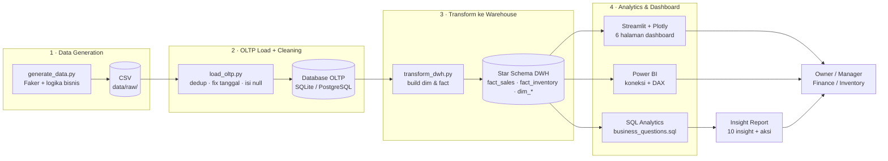

# Architecture

Alur data end-to-end dari generasi data sintetis hingga dashboard BI.



## Layer

| Layer | Tools | Output |
|-------|-------|--------|
| **Generation** | Python, Faker, NumPy | CSV realistis (Indonesia, fashion, musiman) |
| **OLTP** | pandas, SQLAlchemy | Database transaksional bersih |
| **Warehouse** | pandas, SQLAlchemy | Star schema siap analitik |
| **Analytics** | SQL | Jawaban 10 pertanyaan bisnis |
| **Dashboard** | Streamlit, Plotly, Power BI | 6 halaman interaktif |
| **Report** | Markdown | Insight + rekomendasi aksi |

## Orkestrasi
Seluruh pipeline dijalankan dengan satu perintah:
```bash
python etl/run_pipeline.py
```
yang menjalankan `generate_data`, `load_oltp`, lalu `transform_dwh` secara berurutan,
lengkap dengan log jumlah baris dan **rekonsiliasi revenue OLTP vs DWH**.
