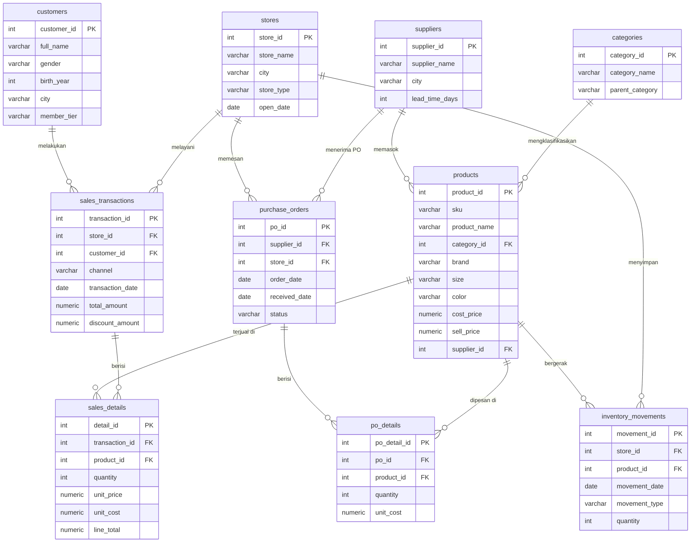

# ERD — OLTP Schema

Entity Relationship Diagram untuk layer transaksional (OLTP). Dirender otomatis oleh
GitHub via Mermaid.

```mermaid
erDiagram
    categories ||--o{ products : "mengklasifikasikan"
    suppliers  ||--o{ products : "memasok"
    suppliers  ||--o{ purchase_orders : "menerima PO"
    stores     ||--o{ sales_transactions : "melayani"
    stores     ||--o{ purchase_orders : "memesan"
    stores     ||--o{ inventory_movements : "menyimpan"
    customers  ||--o{ sales_transactions : "melakukan"
    sales_transactions ||--o{ sales_details : "berisi"
    products   ||--o{ sales_details : "terjual di"
    products   ||--o{ po_details : "dipesan di"
    products   ||--o{ inventory_movements : "bergerak"
    purchase_orders ||--o{ po_details : "berisi"

    categories {
        int category_id PK
        varchar category_name
        varchar parent_category
    }
    suppliers {
        int supplier_id PK
        varchar supplier_name
        varchar city
        int lead_time_days
    }
    products {
        int product_id PK
        varchar sku
        varchar product_name
        int category_id FK
        varchar brand
        varchar size
        varchar color
        numeric cost_price
        numeric sell_price
        int supplier_id FK
    }
    stores {
        int store_id PK
        varchar store_name
        varchar city
        varchar store_type
        date open_date
    }
    customers {
        int customer_id PK
        varchar full_name
        varchar gender
        int birth_year
        varchar city
        varchar member_tier
    }
    sales_transactions {
        int transaction_id PK
        int store_id FK
        int customer_id FK
        varchar channel
        date transaction_date
        numeric total_amount
        numeric discount_amount
    }
    sales_details {
        int detail_id PK
        int transaction_id FK
        int product_id FK
        int quantity
        numeric unit_price
        numeric unit_cost
        numeric line_total
    }
    purchase_orders {
        int po_id PK
        int supplier_id FK
        int store_id FK
        date order_date
        date received_date
        varchar status
    }
    po_details {
        int po_detail_id PK
        int po_id FK
        int product_id FK
        int quantity
        numeric unit_cost
    }
    inventory_movements {
        int movement_id PK
        int store_id FK
        int product_id FK
        date movement_date
        varchar movement_type
        int quantity
    }
```
