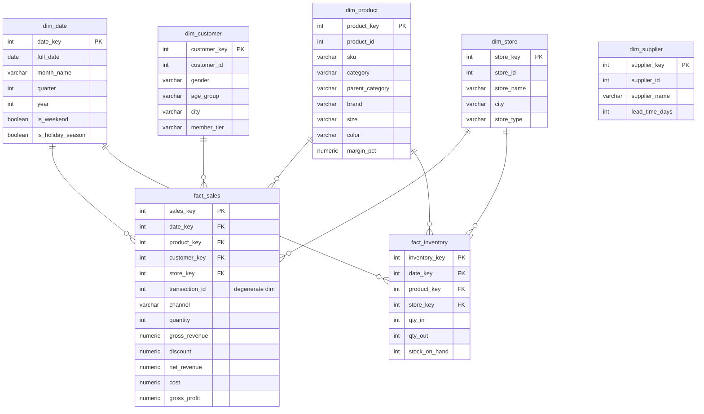

# Star Schema — Data Warehouse

Model dimensional (Kimball) untuk analitik. Dua fact table berbagi dimensi (*conformed
dimensions*): `dim_date`, `dim_product`, `dim_store`.

## Alasan Desain

- **Star (bukan snowflake):** dimensi didenormalisasi → join minimal, query agregasi cepat,
  dan mudah dipahami analis/owner non-teknis.
- **Grain `fact_sales` = line item:** memungkinkan agregasi fleksibel ke level produk,
  kategori, brand, ukuran/warna, cabang, channel, pelanggan, dan waktu tanpa kehilangan detail.
- **Grain `fact_inventory` = pergerakan harian:** mendukung perhitungan `stock_on_hand`
  kumulatif, *stock turnover*, dan deteksi *dead stock*.
- **Surrogate key (`*_key`):** memisahkan warehouse dari natural key OLTP, mempermudah
  penerapan **SCD (Slowly Changing Dimension)** di masa depan.
- **Conformed dimensions:** `dim_date`, `dim_product`, `dim_store` dipakai kedua fact →
  analisis lintas proses (penjualan vs stok) konsisten.
- **Degenerate dimension** `transaction_id` disimpan di fact untuk analisis level keranjang
  (jumlah item per transaksi, AOV).
